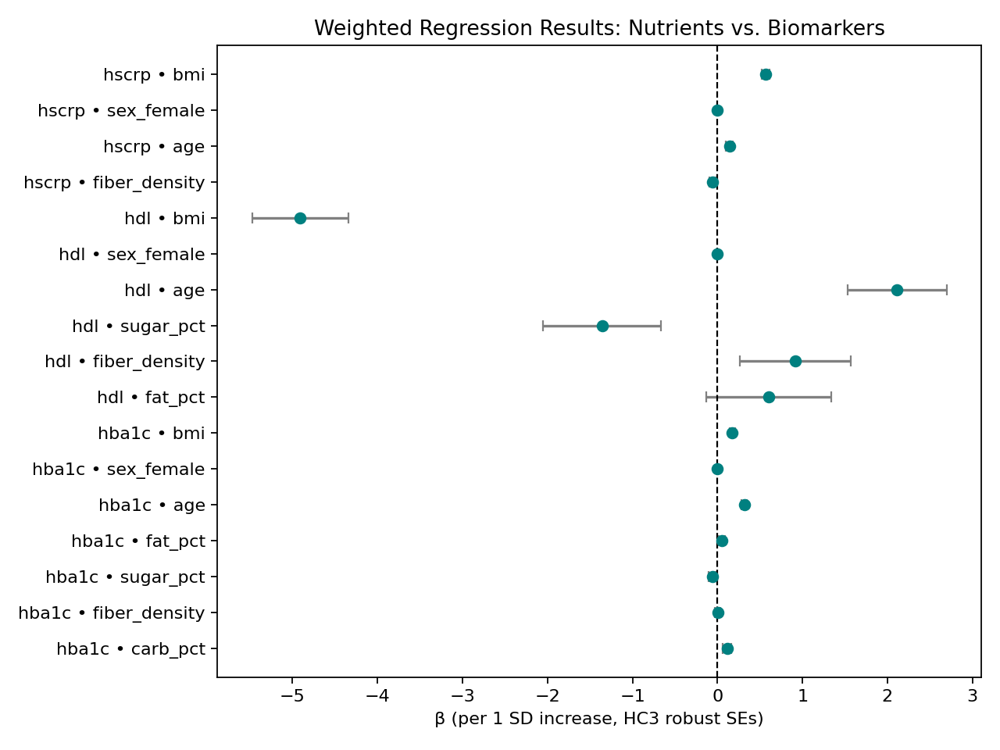

# 🥦 What You Eat, What Your Labs Say  
*Linking NHANES dietary patterns to metabolic biomarkers (2017–2018)*  



---

## 📘 Overview
This project explores how daily nutrient intake patterns — from carbohydrates, fats, fiber, and added sugars — relate to key laboratory biomarkers of metabolic and cardiovascular health.  

Using **NHANES 2017–2018** data, we built a fully reproducible Python pipeline to merge dietary recalls (WWEIA/FNDDS) with biomarker data (HbA1c, HDL, hs-CRP). All analyses apply survey weights and robust standard errors.

---

## 🧩 Methodology
1. **Data ingestion:** Automated XPT/CSV loading and harmonization across NHANES domains (`DEMO`, `DR1TOT`, `GHB`, `HDL`, `HSCRP`, `BMX`).
2. **Feature engineering:** Derived energy-normalized nutrient densities (fiber g/1000 kcal, sodium mg/2000 kcal, % kcal from macronutrients).
3. **Exploratory analysis:** Distribution plots, correlation heatmaps, and PCA-based nutrient patterning.
4. **Modeling:** Weighted least squares regressions (`statsmodels.WLS`) with HC3 robust SEs. Outcomes: HbA1c, HDL, hs-CRP.
5. **Reporting:** Automated Markdown and figure outputs.

---

## 🔬 Key Findings
**Glycemic control (HbA1c):**  
Higher BMI, age, and % kcal from carbohydrate were associated with *higher* HbA1c.  
More fiber per 1000 kcal predicted *lower* HbA1c.

**Lipid profile (HDL):**  
Higher BMI and added sugar intake predicted *lower* HDL.  
Greater fiber and total-fat % kcal were linked to *higher* HDL.

**Inflammation (hs-CRP):**  
Higher BMI and age predicted *higher* hs-CRP.  
Fiber density was inversely associated with inflammation.

> Overall: **High-fiber, low–added-sugar diets** were consistently associated with *healthier biomarker profiles* even after accounting for age, sex, and BMI.

---

## 📊 Outputs
| File | Description |
|------|--------------|
| `data_tidy/diet_labs_analytic.csv` | Clean analytic dataset |
| `figures/hists_labs.png` | Distributions of HbA1c, HDL, log(hs-CRP) |
| `figures/corr_heatmap.png` | Nutrient–lab correlations |
| `figures/scatter_carb_hba1c.png` | Carb % vs HbA1c colored by fiber |
| `figures/pca_biplot.png` | PCA of nutrient densities colored by HbA1c |
| `figures/forest_models.png` | Regression forest plot (main results) |
| `reports/summary.md` | Written summary and interpretation |

---

## ⚙️ Reproducibility
```bash
# Set up environment
python -m venv .venv
source .venv/bin/activate
pip install -r requirements.txt

# Run pipeline
make all
